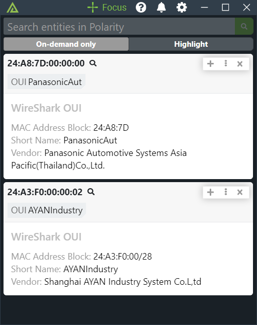

# Polarity WireShark OUI Integration

The Polarity - WireShark OUI integration allows you to look up MAC addresses against the OUI (Organizationally Unique Identifier) information from the WireShark OUI database.  The returned information includes the short name and vendor information for the given OUI.  The OUI is the first three octets of a MAC address and is used to identify the manufacturer of a network device.

This integration uses an offline copy of the WireShark OUI database.  If the "Automatically Update OUI Database" option is enabled the integration will automatically update the OUI database once a week and on the first run of the integration. 

The OUI database is downloaded from: https://www.wireshark.org/download/automated/data/manuf.gz

## Wireshark OUI Integration Options

### Automatically Update OUI Database
If enabled, the integration will automatically update the OUI database from Wireshark's download server once a week. Defaults to enabled.

### Always Return Results
If enabled, the integration will return a result even if the MAC address has no vendor assignment. Defaults to enabled.

## Installation Instructions

Installation instructions for integrations are provided on the [PolarityIO GitHub Page](https://polarityio.github.io/).

## Polarity

Polarity is a memory-augmentation platform that improves and accelerates analyst decision making.  For more information about the Polarity platform please see:

https://polarity.io/
